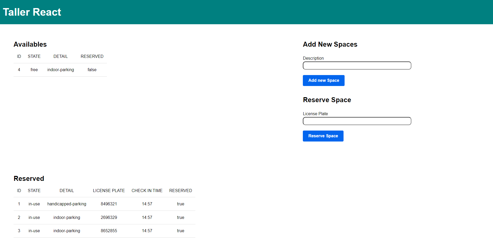

# Parking TEC 🅿️

<!-- GitHub Badges -->
[](https://www.javascript.com/)
[](https://www.conventionalcommits.org/en/v1.0.0/)
[](https://opensource.org/licenses/MIT)
[](https://GitHub.com/Naereen/StrapDown.js/tags/)

`Parking` es el sistema de control del parqueo del TEC. Permite administrar los espacios y realizar reservaciones desde una aplicación web. `Parking API` es el API desarrollada para el manejo de toda la lógica de negocio. 



Parking TEC está desarrollada en React y Express. ¡Puedes correrla en macOS, Windows y Linux!

## ¿Cómo comenzar? 🚀

Para correr el sistema se debe tener instalado `node js` y `react`.

1. Instalar las dependencias del proyecto
```$ npm install```
2. Correr el servidor en modo **desarrollo**.
```$ npm run dev```
3. Correr el servidor en modo **producción**.
```$ npm run start```
   
Check the use of the commands\
 ```$ sales --help```

## Authors

I have developed this project on my way to becoming an Python professional.

* **Esteban Alvarado** - *Software Developer* - [@estalvgs1999](https://github.com/estalvgs1999)
* **Olman Castro** - *Software Developer* - [@estalvgs1999](https://github.com/gaburolo)
* **Martín Calderón** - *Software Developer* - [@estalvgs1999](https://github.com/oldboy379)

This project has been developed as part of Platzi's **CRUD with python** course. The thanks for this project go to [Platzi](https://platzi.com/clases/python-practico/)!

## License 📄

This project is licensed under the GNU License - see the [LICENSE.md](https://github.com/estalvgs1999/PLJS02-Typescript-Fundamentals/blob/master/LICENSE) file for details

---

<p align="center">

</p>